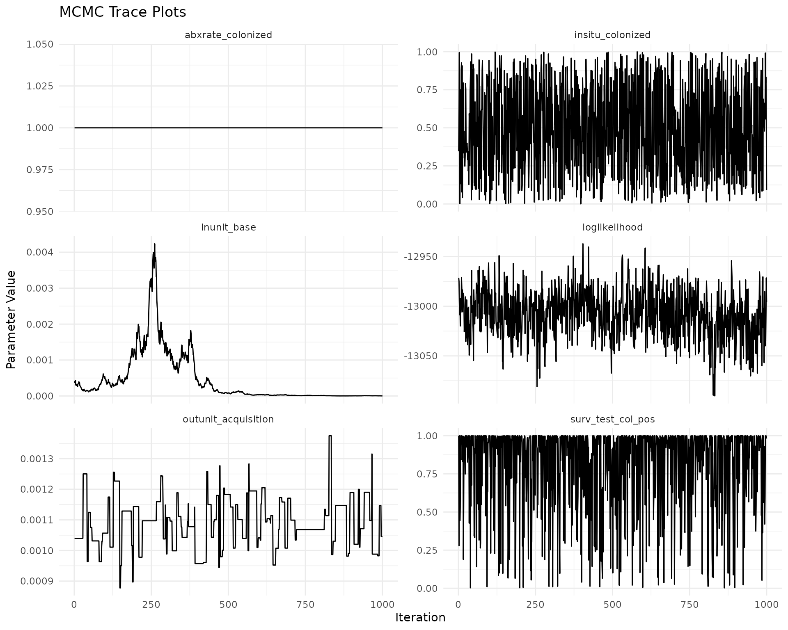
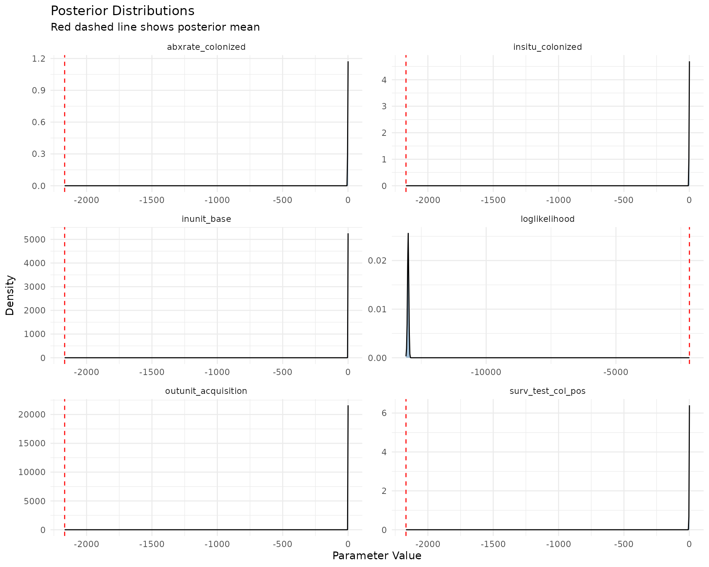

# Bayesian Transmission Modeling

``` r
library(bayestransmission)
```

## Introduction

This package provides a Bayesian framework for transmission modeling on
an individual patient level. Modeling is conducted through Markov Chain
Monte Carlo (MCMC) methods.This document will explain the basic usage of
the package, specification of parameters, and the output of the model.

## Data Structure

The algorithms expect a longitudinal data set with the following
columns: \* `facility`: The facility where the event occurred. \*
`unit`: The unit within the facility where the event occurred. \*
`time`: The time at which the event occurred. \* `patient`: The patient
involved in the event. \* `type`: The type of event.

The package includes a simulated dataset, `simulated.data`.

``` r
pillar::glimpse(simulated.data)
#> Rows: 8,360
#> Columns: 5
#> $ facility <int> 1, 1, 1, 1, 1, 1, 1, 1, 1, 1, 1, 1, 1, 1, 1, 1, 1, 1, 1, 1, 1…
#> $ unit     <int> 1, 1, 1, 1, 1, 1, 1, 1, 1, 1, 1, 1, 1, 1, 1, 1, 1, 1, 1, 1, 1…
#> $ time     <dbl> 0.060978, 0.061978, 1.560978, 2.883323, 2.884323, 1.422631, 1…
#> $ patient  <int> 1, 1, 1, 1, 1, 10, 10, 10, 10, 19, 19, 19, 23, 23, 23, 28, 28…
#> $ type     <int> 0, 1, 10, 1, 3, 0, 1, 1, 3, 0, 1, 3, 0, 1, 3, 0, 1, 1, 3, 0, …
```

There are 12 different types of events that can be specified in the
`type` column. These are, expected numerical codes shown in parentheses:

- Admission (0) and Discharge (3)
- Surveillance Testing Results
  - Negative Test (1)
  - Positive Test (2)
- Clinical Testing Results
  - Negative Test (4)
  - Positive Test (5)
- Generic Testing
  - Negative Test (7)
  - Positive Test (8)
- Antibiotic Use
  - single dose (9)
  - Start (10)
  - Stop (11)
- Isolation Procedures
  - Start (6)
  - Stop (7)

Not all events need to be used in every data set, but the model selected
should reflect the data that is available. Care should be taken to
correctly code the data. The `EventToCode` and `CodeToEvent` functions
can be used to convert between.

``` r
table(CodeToEvent(simulated.data$type))
#> 
#>      abxoff       abxon   admission   discharge negsurvtest possurvtest 
#>         297         725        2183        2183        2749         223
```

## Model Specifiction

### Model Choice

Since the model is implemented in C++ for speed and efficiency, only the
specified models can be used. The currently implemented models are:

- `"LinearAbxModel"`, A Linear model with antibiotic use as a covariate.
- `"MixedModel"`, and
- `"LogNormalModel"`

Model specification and all parameters are controlled through
constructor functions of the same name, or generically through the
[`LogNormalModelParams()`](https://epiforesite.github.io/bayestransmission/reference/LogNormalModelParams.md)
function.

For all models there is the choice of either a 2 state (susceptible and
colonized) or 3 state (susceptible, colonized, and recovered or latent)
model. Number of states is set through the `nstates` parameter, and the
number of states in the model overrides what may be specified in any
individual component.

### Parameters

The remainder of the parameters are grouped into the following
categories:

- `Abx`, Antibiotic use,
- `AbxRate`, Antibiotic rates,
- `InUnit`, In unit infection rates,
- `OutOfUnitInfection`, Out of unit infection rates,
- `Insitu`, In situ parameters,
- Testing:
  - `SurveilenceTest`, Surveillance testing,
  - `ClinicalTest`, Clinical testing.

Unless otherwise specified the parameters are all distributed gamma with
specified shape and rate parameters. Each parameter can also be left as
fixed or be sampled at each iteration of the MCMC.

#### Specifying parameters

Parameters for the model may be specified by the
[`Param()`](https://epiforesite.github.io/bayestransmission/reference/Param.md)
function. This function takes up to four arguments:

    1. `init`, is the initial value of the parameter.
    2. `weight`, is the weight of the prior distribution in updates.
    3. `update`, a flag of if the parameter should be sampled in the MCMC algorithm. 
        `FALSE` indicates that the parameter should be fixed, and is by default `TRUE` when `weight` is greater than zero.
    4. `prior`, the mean of the prior distribution.  Taken with the weight will fully parameterize the distribution.

**Important:** Always explicitly specify `init` values for parameters to
ensure reproducibility and avoid potential numerical issues.

``` r
# Fully specified parameter.
Param(init = 0, weight = 1, update = TRUE, prior = 0.5)
# Fixed parameter with explicit init
# Weight = 0 implies update=FALSE and prior is ignored.
Param(init = 0, weight = 0)
# Updated parameter that starts at zero.
Param(init = 0, weight = 1, update = TRUE)
# Short form for fixed parameter
Param(init = 0, weight = 0)
```

### `Abx` Antibiotic use

Antibiotic use is specified by the `Abx` parameter. This parameter is a
list constructed with the
[`AbxParams()`](https://epiforesite.github.io/bayestransmission/reference/AbxParams.md)
function with the following components:

- `onoff`, If antibiotics are being used or not. The two following
  parameters are only used if `onoff` is `TRUE`.
- `delay`, the delay for the antibiotic to take effect.
- `life`, the duration where the antibiotic to be effective.

``` r
abx <- AbxParams(onoff = 0, delay = 0.0, life = 2.0)
```

Currently, all antibiotics are assumed to be equally effective and have
the same duration of effectiveness. Note: `onoff = 0` means antibiotics
are turned off for this example (set to 1 to enable).

### `AbxRate` Antibiotic rates

The `AbxRate` parameter control the antibiotic administration rates.

``` r
abxrate <- AbxRateParams(
  # Fixed parameters when antibiotics are off
  uncolonized = Param(init = 1.0, weight = 0),
  colonized = Param(init = 1.0, weight = 0)
)
```

Here since both parameters are non-zero both will be updated. A rate of
zero for either would indicate that group would never be on antibiotics.
When antibiotics are turned off (`Abx$onoff = 0`), these parameters are
typically fixed (weight = 0).

### `InUnit` In unit infection rate

Transmission within unit is the main defining characteristic that
differentiates models. For example the linear antibiotic model,
[`LinearAbxModel()`](https://epiforesite.github.io/bayestransmission/reference/LogNormalModelParams.md),
is differentiated from the log normal model,
[`LogNormalModelParams()`](https://epiforesite.github.io/bayestransmission/reference/LogNormalModelParams.md)
by the use of a
[`ABXInUnitParams()`](https://epiforesite.github.io/bayestransmission/reference/InUnitParams.md)
for the `InUnit` argument rather than the `LogNormalInUnitAcquisition()`
which does not take into account antibiotic use. All in unit
transmission is defined in terms of acquisition, progression, and
clearance.

#### Aqcuisition Model

In the base log normal antibiotic model,
`LogNormalABXInUnitParameters()` log acquisition probability is a linear
function.

$$\log\left( P\left( {Acq(t)} \right) \right) = \beta_{0} + \beta_{t}\left( t - t_{0} \right) + \beta_{c}N_{c}(t) + \beta_{ca}N_{ca}(t) + \beta_{A}A_{i}(t) + \beta_{E}E_{i}(t)$$

Where $\beta_{\star}$ represents the coefficient corresponding to the
amounts, $N_{c}(t)$ represent the total number of colonized patients at
time $t$, $N_{ca}(t)$ the number of colonized on antibiotics, and
$A_{i}(t)$ and $E_{i}(t)$ represents if patient $i$ is currently or ever
on antibiotics.

The linear antibiotic (`LinearAbxAcquisitionParams`) takes a more
complicated form for the acquisition model.

$$P\left( {Acq(t)} \right) = \left\lbrack e^{\beta_{time}{(t - t_{0})}} \right\rbrack\left\{ e^{\beta_{0}}\left\lbrack \left( \frac{\beta_{freq}}{P(t)} + \left( 1 - e^{\beta_{freq}} \right) \right)e^{\beta_{mass}}\left( \left( N_{c}(t) - N_{ca}(t) \right) + e^{\beta_{col\_ abx}}N_{ca}(t) \right) + 1 - e^{\beta_{mass}} \right\rbrack \right\}\left\lbrack N_{S}(t) - N_{E}(t) + e^{\beta_{suss\_ ever}}\left( \left( E_{i}(t) - A_{i}(t) \right) + A_{i}(t)e^{\beta_{suss\_ abx}} \right) \right\rbrack$$

``` r
acquisition <- LinearAbxAcquisitionParams(
    base = Param(init = 0.001, weight = 1),     #< Base acquisition rate (Updated)
    time = Param(init = 1.0, weight = 0),       #< Time effect (Fixed)
    mass = Param(init = 1.0, weight = 1),       #< Mass Mixing (Updated)
    freq = Param(init = 1.0, weight = 1),       #< Frequency/Density effect (Updated)
    col_abx = Param(init = 1.0, weight = 0),    #< Colonized on antibiotics (Fixed)
    suss_abx = Param(init = 1.0, weight = 0),   #< Susceptible on antibiotics (Fixed)
    suss_ever = Param(init = 1.0, weight = 0)   #< Ever on antibiotics (Fixed)  
)
```

#### Progression Model

In the 3 state model there is a latent state and the progression model
controls how patient transition out of the latent state. The base rate
can be affected by currently being on antiboitics or ever being on
antbiotcs.

$$\log\left( P\left( {progression} \right) \right) = \delta_{0} + \delta_{A}A_{i}(t) + \delta_{E}E_{i}(t)$$
the linear antibiotic model is:

$$P\left( {progression} \right) = e^{\delta_{0}}\left\lbrack 1 - E_{i}(t) + e^{\delta_{2}}\left( E_{i}(t) - A_{i}(t) + e^{\delta_{1}}A_{i}(t) \right) \right\rbrack$$

Where here we use $\delta$ for the coefficients, but the notation is the
same.

``` r
progression <- ProgressionParams(
    rate = Param(init = 0.0, weight = 0),      #< Base progression rate (Fixed for 2-state)
    abx  = Param(init = 1.0, weight = 0),      #< Currently on antibiotics (Fixed)
    ever_abx = Param(init = 1.0, weight = 0)   #< Ever on antibiotics (Fixed)
)
```

#### Clearance Model

The clearance model is the same as the progression model in both the log
normal and the linear cases, the coefficients however are independent.

``` r
clearance <- ClearanceParams(
    rate = Param(init = 0.01, weight = 1),     #< Base clearance rate (Updated)
    abx  = Param(init = 1.0, weight = 0),      #< Currently on antibiotics (Fixed)
    ever_abx = Param(init = 1.0, weight = 0)   #< Ever on antibiotics (Fixed)
)
```

``` r
inunit <- ABXInUnitParams(
  acquisition = acquisition,
  progression = progression,
  clearance   = clearance
)
```

### Out of Unit Importation

The out of unit parameters control the rate at which admissions come in,
and which state they enter in.

$$\log\left( P\left( {state}_{i}\rightarrow{state}_{j} \right)|t \right) = P_{j} - Q_{i,j}e^{- t\sum\limits_{i}r_{i}}$$

``` r
outcol <- OutOfUnitInfectionParams(
  acquisition = Param(init = 0.001, weight = 1),
  clearance = Param(init = 0.01, weight = 0),
  progression = Param(init = 0.0, weight = 0)
)
```

### In Situ

I’m not sure what these parameters do. It’s a set of gamma distributed
parameters one for each state. The updates and probabilities are not
time dependent.

When updating the rates for each state are sampled from a
$gamma\left( N_{i},1 \right)$ distribution. Then all three are
normalized to sum to 1.

``` r
insitu <- InsituParams(
  # Starting 90/10 split uncolonized to colonized
  # For 2-state model, latent probability is 0
  probs = c(uncolonized = 0.90,
            latent = 0.0,
            colonized = 0.10),
  # Prior values for Bayesian updating  
  priors = c(1, 1, 1),
  # Which states to update (latent is fixed at 0 for 2-state model)
  doit = c(TRUE, FALSE, TRUE)
)
```

### Testing

There are two types of testing, surveillance, which is conducted
routinely at regular intervals such as on admission then every 3 days
after, and clinical, where the testing is precipitated by staff, and
thus the timing is informative.

#### Surveillance Testing

The timing of surveillance testing is assumed to not be informative.
Therefore, surveillance testing is only parameterized in terms of
probability of a positive test given the underlying status. Surveillance
test parameters are updated with a sample from a
$Beta\left( N_{s,1},N_{s,0} \right)$ distribution where $N_{s,1}$ and
$N_{s,0}$ are the number of positive and negative tests respectively for
state $s$.

``` r
surv <- SurveillanceTestParams(
    # Probability of a positive test when uncolonized (false positive rate)
    # IMPORTANT: Must be > 0 to avoid -Inf likelihood. Use small value like 1e-10.
    # Setting to exactly 0.0 causes log(0) = -Inf if any uncolonized patient tests positive.
    uncolonized = Param(init = 1e-10, weight = 0),
    # Probability of a positive test when colonized (true positive rate/sensitivity)
    # Starting at 0.8, will be updated during MCMC
    colonized = Param(init = 0.8, weight = 1),
    # Latent state (for 2-state model, this is not used but must be specified)
    latent = Param(init = 0.0, weight = 0)
)
```

#### Clinical Testing

Since clinical testing time is informative, clinical testing is assumed
to be at random within infection stage. The rate of testing within each
stage is sampled from a gamma distribution. Sensitivity/Specificity are
handled the same as surveillance testing and the likelihood is
multiplicative between rate and effectiveness.

``` r
clin <- RandomTestParams(
    # Rate of testing when uncolonized
    uncolonized = ParamWRate(
      param = Param(init = 0.5, weight = 0), 
      rate = Param(init = 1.0, weight = 0)
    ),
    # Rate of testing when colonized  
    colonized = ParamWRate(
      param = Param(init = 0.5, weight = 0), 
      rate = Param(init = 1.0, weight = 0)
    ),
    # Latent state (for 2-state model, not used but must be specified)
    latent = ParamWRate(
      param = Param(init = 0.5, weight = 0), 
      rate = Param(init = 1.0, weight = 0)
    )
)
```

#### All Together

``` r
params <- LinearAbxModel(
  nstates = 2,
  Insitu = insitu,
  SurveillanceTest = surv,
  ClinicalTest = clin,
  OutOfUnitInfection = outcol,
  InUnit = inunit,
  Abx = abx,
  AbxRate = abxrate
)
```

## Running the Model

The model is run through the
[`runMCMC()`](https://epiforesite.github.io/bayestransmission/reference/runMCMC.md)
function. The function takes the following arguments:

- `data`: The data frame with patient event data
- `modelParameters`: The model specification (created above)
- `nsims`: Number of MCMC samples to collect after burn-in
- `nburn`: Number of burn-in iterations (default: 100)
- `outputparam`: Whether to save parameter values at each iteration
  (default: TRUE)
- `outputfinal`: Whether to save the final model state (default: FALSE)
- `verbose`: Whether to print progress messages (default: FALSE)

``` r
system.time(
  results <- runMCMC(
    data = simulated.data_sorted,
    modelParameters = params,
    nsims = 1000,
    nburn = 100,
    outputparam = TRUE,
    outputfinal = TRUE,
    verbose = FALSE
  )
)
#>    user  system elapsed 
#> 172.984 158.879 166.302
```

## Analyzing MCMC Results

### Converting Parameters to Data Frame

The `results$Parameters` object contains the MCMC chain of all model
parameters. To create trace plots and posterior distributions, we use
the
[`mcmc_to_dataframe()`](https://epiforesite.github.io/bayestransmission/reference/mcmc_to_dataframe.md)
function to convert this nested list structure into a tidy data frame
format.

``` r
# Convert parameters to data frame using package function
param_df <- mcmc_to_dataframe(results)

# Display first few rows
head(param_df)
#>   iteration insitu_uncolonized insitu_colonized surv_test_uncol_neg
#> 1         1         0.65408410      0.345915901               1e-10
#> 2         2         0.41940536      0.580594642               1e-10
#> 3         3         0.00480183      0.995198170               1e-10
#> 4         4         0.97985172      0.020148280               1e-10
#> 5         5         0.99855862      0.001441382               1e-10
#> 6         6         0.39104620      0.608953797               1e-10
#>   surv_test_col_neg surv_test_uncol_pos surv_test_col_pos clin_test_uncol
#> 1         0.8447528               1e-10         0.9998983             0.5
#> 2         0.8029492               1e-10         0.2790169             0.5
#> 3         0.8518281               1e-10         1.0000000             0.5
#> 4         0.8484905               1e-10         0.9995797             0.5
#> 5         0.8526668               1e-10         0.4436542             0.5
#> 6         0.7994312               1e-10         0.5293115             0.5
#>   clin_test_col clin_rate_uncol clin_rate_col outunit_acquisition
#> 1           0.5               1             1          0.00103972
#> 2           0.5               1             1          0.00103972
#> 3           0.5               1             1          0.00103972
#> 4           0.5               1             1          0.00103972
#> 5           0.5               1             1          0.00103972
#> 6           0.5               1             1          0.00103972
#>   outunit_clearance  inunit_base inunit_time inunit_mass inunit_freq
#> 1              0.01 0.0003624024           1           1           1
#> 2              0.01 0.0004016161           1           1           1
#> 3              0.01 0.0004127463           1           1           1
#> 4              0.01 0.0004347049           1           1           1
#> 5              0.01 0.0003035432           1           1           1
#> 6              0.01 0.0003274638           1           1           1
#>   inunit_colabx inunit_susabx inunit_susever  inunit_clr inunit_clrAbx
#> 1             1             1              1 0.002108148             1
#> 2             1             1              1 0.002154422             1
#> 3             1             1              1 0.002246149             1
#> 4             1             1              1 0.002240994             1
#> 5             1             1              1 0.002207258             1
#> 6             1             1              1 0.002068119             1
#>   inunit_clrEver abxrate_uncolonized abxrate_colonized loglikelihood
#> 1              1                   1                 1     -12971.40
#> 2              1                   1                 1     -12975.10
#> 3              1                   1                 1     -12994.34
#> 4              1                   1                 1     -13008.59
#> 5              1                   1                 1     -12992.41
#> 6              1                   1                 1     -13019.92
```

### Trace Plots

Trace plots show the evolution of parameters across MCMC iterations,
helping to assess convergence.

``` r
library(ggplot2)
library(tidyr)

# Select key parameters for trace plots
trace_params <- param_df[, c("iteration", "insitu_colonized", "surv_test_col_pos", 
                              "outunit_acquisition", "inunit_base", 
                              "abxrate_colonized", "loglikelihood")]

# Convert to long format
trace_long <- pivot_longer(trace_params, 
                           cols = -iteration,
                           names_to = "parameter",
                           values_to = "value")

# Create trace plots
ggplot(trace_long, aes(x = iteration, y = value)) +
  geom_line() +
  facet_wrap(~parameter, scales = "free_y", ncol = 2) +
  theme_minimal() +
  labs(title = "MCMC Trace Plots",
       x = "Iteration",
       y = "Parameter Value")
```



### Posterior Distributions

Posterior distributions show the estimated distribution of each
parameter after the MCMC sampling.

``` r
# Remove burn-in if needed (here we already set nburn in the MCMC call)
# For demonstration, let's use all samples since nburn=0 was specified

# Create density plots for posterior distributions
ggplot(trace_long, aes(x = value)) +
  geom_density(fill = "steelblue", alpha = 0.5) +
  geom_vline(aes(xintercept = mean(value, na.rm = TRUE)), 
             color = "red", linetype = "dashed") +
  facet_wrap(~parameter, scales = "free", ncol = 2) +
  theme_minimal() +
  labs(title = "Posterior Distributions",
       subtitle = "Red dashed line shows posterior mean",
       x = "Parameter Value",
       y = "Density")
```



### Summary Statistics

``` r
# Calculate summary statistics for each parameter
library(dplyr)
#> 
#> Attaching package: 'dplyr'
#> The following objects are masked from 'package:stats':
#> 
#>     filter, lag
#> The following objects are masked from 'package:base':
#> 
#>     intersect, setdiff, setequal, union

summary_stats <- trace_long %>%
  group_by(parameter) %>%
  summarise(
    mean = mean(value, na.rm = TRUE),
    median = median(value, na.rm = TRUE),
    sd = sd(value, na.rm = TRUE),
    q025 = quantile(value, 0.025, na.rm = TRUE),
    q975 = quantile(value, 0.975, na.rm = TRUE),
    .groups = "drop"
  )

print(summary_stats)
#> # A tibble: 6 × 6
#>   parameter                    mean        median         sd     q025       q975
#>   <chr>                       <dbl>         <dbl>      <dbl>    <dbl>      <dbl>
#> 1 abxrate_colonized        1             1         0          1   e+0   1    e+0
#> 2 insitu_colonized         0.502         0.502     0.293      2.48e-2   9.74 e-1
#> 3 inunit_base              0.000428      0.000100  0.000704   2.42e-6   2.66 e-3
#> 4 loglikelihood       -13008.       -13008.       24.1       -1.31e+4  -1.30 e+4
#> 5 outunit_acquisition      0.00109       0.00109   0.0000817  9.57e-4   1.25 e-3
#> 6 surv_test_col_pos        0.803         0.952     0.276      6.47e-2   1.000e+0
```
